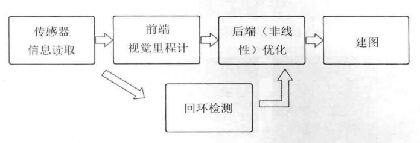

# 第1讲 预备知识

（1）SLAM定义

​		**SLAM**，即**S**imultaneous **L**ocation **a**nd **M**apping，同步定位与地图构建[1 ]，指搭载特定传感器的主体，在没有环境先验信息的情况下，于运动过程中建立环境的模型，同时估计自己的运动。

​		（个人观点）若**偏向定位**，则向轻量化的、快速跟踪自身位置的定位系统发展；若**偏向建图**，则向三维重建等注重地图、模型构建的方向发展。

（2）**SLAM相关书籍**

1. 《概率机器人》（*Probabilistic Robotics*）
2. 《计算机视觉中的多视图几何》（*Multiple View Geometry in Computer Vision*）
3. 《机器人学中的状态估计》（*State Estimation for Robotics: A Matrix-Lie-Group Approach*）
4. 《机器人感知-因子图在SLAM中的应用》（*Factor Graphs for Robot Perception*）

（3）SLAM**模块**划分

- 视觉里程计、后端优化、建图、后端优化、回环检测

（4）使用到的**库**

- Eigen, Sophus, OpenCV, PCL, g2o, Ceres, GTSAM

（5）**本书划分**

- 第一部分：**数学基础**篇

  - 第1讲：预备知识，基本介绍，自测习题

  - 第2讲：系统概述，组成模块，编程环境搭建过程

  - 第3讲：三维空间刚体运动，旋转矩阵、欧拉角、四元数，Eigen库

  - 第4讲：李群和李代数，定义及使用方法，Sophus库

  - 第5讲：针孔相机模型，计算机图像表示，OpenCV库

  - 第6讲：非线性优化，包括状态估计理论基础、最小二乘、梯度下降，Ceres和g2o库

- 第二部分：**实践应用**篇

  - 第7讲：特征点法的视觉里程计，包括特征点提取、对极几何约束计算、PnP和ICP等。
    - 实践：用这些方法估计两个图像之间的运动。
  - 第8讲：直接法的视觉里程计，包括光流和直接法原理。
    - 实践：一个简单的直接法运动估计。
  - 第9讲：后端优化，深入讨论Bundle Adjustment（BA）及利用稀疏性加速求解。
    - 实践：用Ceres和g2o分别书写一个BA程序。
  - 第10讲：后端优化中的位姿图，表达关键帧之间约束的一种更紧凑的形式。
    - 实践：SE(3)和Sim(3)的位姿图，以及使用g2o对一个位姿球进行优化。
  - 第11讲：回环检测，词袋方法。
    - 实践：使用DBoW3书写字典训练和回环检测程序。
  - 第12讲：地图构建，单目稠密深度图估计、RGB-D稠密地图构建。
    - 实践：书写极线搜索和块匹配程序，RGB-D构建点云地图和八叉树地图。
  - 第13讲：工程实践，搭建一个双目视觉里程计框架，会包含优化、关键帧选择等问题。
    - 实践：在Kitti数据集上测试性能，讨论一些改进手段。
  - 第14讲：介绍开源SLAM方案、未来发展方向等。

## （6）习题

1. 

2. 高斯分布

3. ① 类是用于指定对象的形式，它包含了**数据表示法**和**用于处理数据的方法**；

   ② STL（Standard Templete Library），标准模板库，是一套功能强大的C++模板类，其核心包括容器、算法、迭代器三个组件，带有丰富的预定义函数，帮助我们通过简单的方式处理复杂的任务。

   ③ 使用过。

4. 在Visual Studio中直接建立工程书写，或在linux环境的clion/vscode中书写并用CMake编译运行。

5. ① 知道，是C++98发布13年之后的第一次重大修正。② 

6. 知道，使用过Ubuntu。

7. Linux的目录结构是：；我知道的基本命令有rm、cp、dpkg、mkdir等等。

8. 命令行安装；会直接被安装在根目录中的默认位置；可以通过TAB补全的方式找到软件名称，一般依赖库多为`lib\<name>-dev`的名称形式。

9. Vim学习。

# 第2讲 初始SLAM

​		**定位**和**建图**是一个自主移动机器人感知的内外两面：一方面要明白自身的状态（位置），另一方面要明白外在的环境（地图），固定到环境中的传感器简单、直接地测量机器人位置信息但是束缚了外部环境，无法提供普遍的、通用的解决方案，而基于机载传感器间接推算自身位置，对环境不提出任何要求，适用于位置环境。

​		激光SLAM相对成熟，《概率机器人》中介绍了许多相关知识。

​		本书主题为视觉SLAM，包括单目相机、双目相机、RGB-D相机、全景相机、事件相机等等。

## 2.1 相机简介

### （1）单目相机

​		由于单目相机拍摄的图像只是三维空间的二维投影，如果真想恢复三维结构，必须改变相机视角，也即相机必须**运动**（motion），才能估计场景中物体的远近和大小（称之为**结构**，Structure）。相机通过运动中形成的图像间视差定量判断物体远近。

​		单目SLAM估计的轨迹和地图将与实际轨迹和地图相差一个因子——尺度。

### （2）双目相机和深度相机

​		通过某种手段测量物体与相机距离，场景三维结构可以在单个图片恢复，同时克服尺度不确定性。

​		双目相机两相机之间的距离称为基线（Baseline）。基线越大，可测距离越远，配置与标定较为复杂，深度量程和精度受到双目基线和分辨率所限，且视差计算非常消耗计算资源（主要问题之一）。

​		深度相机，通过红外结构光或Time-of-Flight（ToF）原理，直接测出物体与相机距离，节省大量计算资源，缺点是测量范围窄、噪声大、视野小、易受日光干扰、无法测量投射材质等，主要用于室内，室外较难应用。

## 2.2 经典视觉SLAM框架

​		SLAM不是某种简单的、只要输入数据就可以不断输出定位和地图信息的算法，它需要一个完善的代码框架。

​	以下是经典的视觉SLAM框架：

**SLAM流程步骤**：

1. **传感器信息读取**：传感器信息的读取和预处理。
2. **前端视觉里程计**（Front End）：估计相邻图像间相机的运动及局部地图。
   - 与【计算机视觉】更相关，如图像的特征点提取与匹配
   - 会出现累计漂移，需要通过后端优化和回环检测进行校正。
3. **后端（非线性）优化**（Back End）：接收不同时刻里程计的相机位姿和回环检测信息，对其进行优化并获得全局一致的轨迹和地图。
   - 【滤波与非线性优化】算法
   - 从带有噪声的数据中估计整个系统状态（轨迹+地图），以及这个状态估计的不确定性（最大后验概率估计，Maximum-a-Posteriori，MAP）。
4. **回环检测**（Loop Closure）：检测回环，并向信息提供给后端。
   - 判断图像间相似性
5. **建图**（Mapping）：根据估计轨迹和其他等信息，建立与任务要求对应的地图。
   - 不同的应用对应不同的地图需求；地图可以分为度量地图（稀疏/稠密）、拓扑地图等等

如果把环境限定在<u>静态的、刚体的、光照变化不明显的、没有人为干扰的场景</u>，那么这种场景下的SLAM技术以及相对成熟了。

## 2.3 SLAM问题的数学表述

​		把一段连续时间的运动变成了离散时刻 $t=1,..,K$ 当中发生的事情，机器人在各时刻的位置记为 $x_1,...,x_K$ ，地图由许多个路标组成，用表示 $y_1,...,y_N$ 表示它们。

- **运动**： $k+1$ 时刻到 $k$ 时刻，机器人位置 $x$ 如何变化。

  - $$
    x_k=f(x_{k-1},u_k,w_k)
    $$

  - 参数：$k-1$ 时刻位置，运动传感器读数/输入，过程噪声

- **观测**：机器人在 $k$ 时刻于 $x_k$ 处探测到某一路标 $y_j$ 。

  - $$
    z_{k,j}=h(y_j,x_k,v_{k,j})
    $$

  - 参数：某一路标点，$k$ 时刻位置，观测噪声

运动和观测方程描述了最基本的SLAM问题，状态估计问题，状态估计问题的求解，总体上经历了从滤波方法到优化方法的转变。

- **滤波**方法：EKF为主的预测+更新，后开始使用离子滤波器
- **优化**方法：以图优化为代表的，当前主流

## 2.4 编程实践